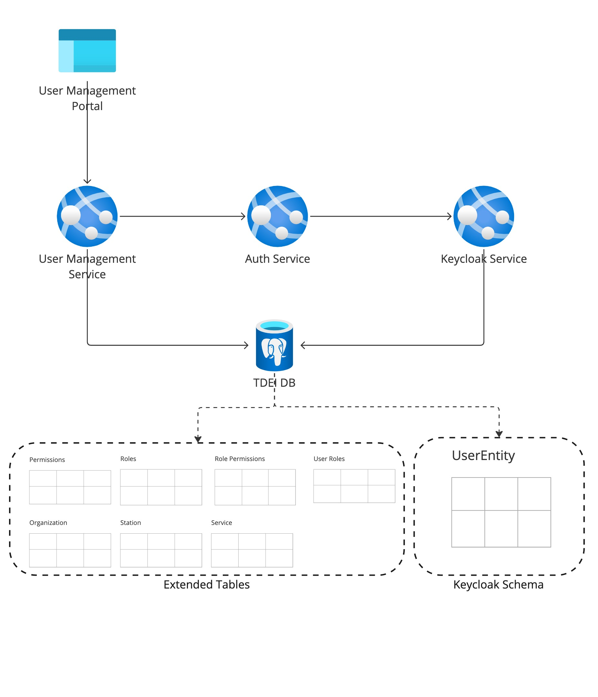

# Introduction 
User management service helps TDEI system to manage the user permissions and TDEI entities like organization, stations, service.

## Getting Started
The project is built on NodeJS framework. All the regular nuances for a NodeJS project are valid for this.

## System requirements
| Software | Version|
|----|---|
| NodeJS | 16.17.0|
| Typescript | 4.8.2 |

### Local setup
---

Step 1: Application configuration is read from .env file. Below are the list of environemnt variables service is dependent on. An example of environment file is available [here](./env.example) and description of environment variable is presented in below table

|Name| Description |  
|--|--|  
|PROVIDER | Provider for cloud service or local |
|QUEUECONNECTION | Queue connection string |
|STORAGECONNECTION | Storage connection string|
|PORT |Port on which application will run|
|DATABASE_USER | Keycloak secret from portal |  
|DATABASE_HOST | Queue connection string |  
|DATABASE_PASSWORD | Storage connection string|  
|DATABASE_DB |Port on which application will run|  
|DATABASE_PORT | Upload topic subscription name|  
|AUTH_HOST | Base URL for authentication service |

Step 2: Spin up Postgres server and PgAdmin dashboard for visualization. Docker need to be install on the system first before proceeding.
```docker compose up``` from root directory

Step 3: Create the database tdei in the Postgresql

Step 4: Run the script init.sql under script folder. That will create table schemas in the database [One time]

Step 5: Run the script master-data.sql under script folder. This will insert the master roles, permissions, test users in the database

#### Build
---

Follow the steps to install the node packages required for both building and running the application

1. Install the dependencies. Run the following command in terminal on the same directory as `package.json`
    ```shell
    npm install
    ```

2. To start the server, use the command `npm run start`

3. The http server by default starts with 8080 port or whatever is declared in `PORT`

4. By default `health/ping` call on `localhost:8080` gives a sample response

## Test

Follow the steps to install the node packages required for testing the application

1. Ensure we have installed the dependencies. Run the following command in terminal on the same directory level as `package.json`
    ```shell
    npm install
    ```
2. To start testing suits, use the command `npm test` , this command will execute all the unit test suites defined for application.

Note: Unit test doesnt require any of the env variables. Running the above command will execute the suites.

## How to run integration test
To run integration test you need a `.env` file which will be available on request.

Steps to run:

Execute the following commands.

```
npm run i
```

``` 
npm run test:integration
```

## Required env for running tests

For running integration test, following env variables are required.

|Name| Description |
|--|--|
|QUEUECONNECTION | Queue connection string |
|STORAGECONNECTION | Storage connection string|
|AUTH_HOST | Host of the authentication service |
|VALIDATION_SUBSCRIPTION | Upload topic subscription name|
|VALIDATION_TOPIC | Validation topic name|
|DATASVC_TOPIC | Data service publishing topic|


## System flow diagram
---

Detailed use case description can be found [here](https://github.com/TaskarCenterAtUW/TDEI-internaldocs/blob/master/adr/user-management-flow.md)




